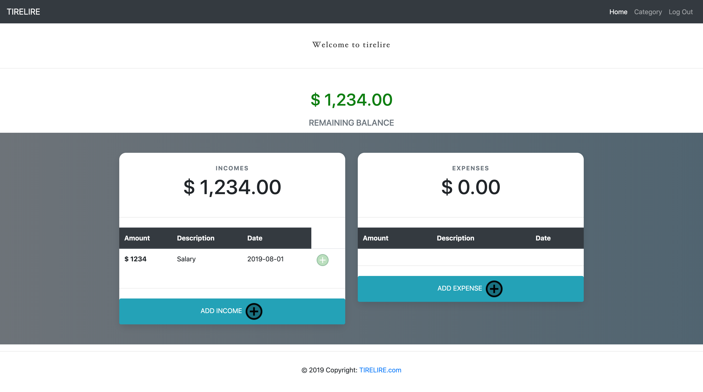
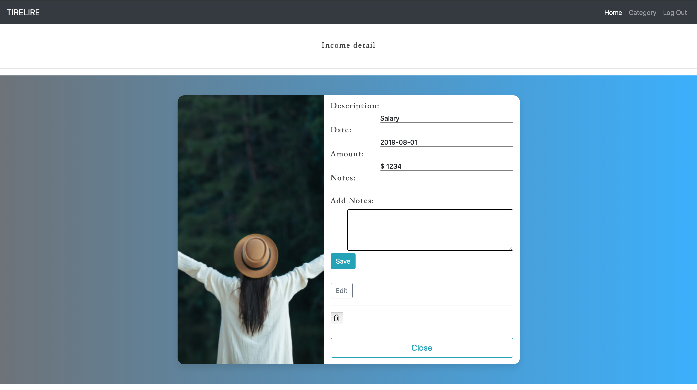

# tirelire_project

## Project 

**Tirelire** is an application for adults who need a clear understanding of how much they’re spending and how it’s being spent.

## ScreenShots

## Technologies Used

- `MongoDb`
- `Mongoose`
- `Express`
- `CSS`
- `Bootstrap`
- `Jquery`
- `HTML`
- `JavaScript`

## Link

Link of the app [here](https://tirelire1.herokuapp.com/users)

## Future implementations

- Group all the expenses by category
- Pie chart
